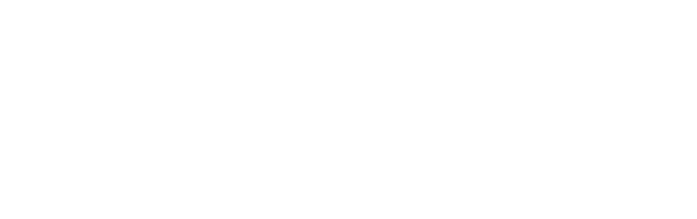
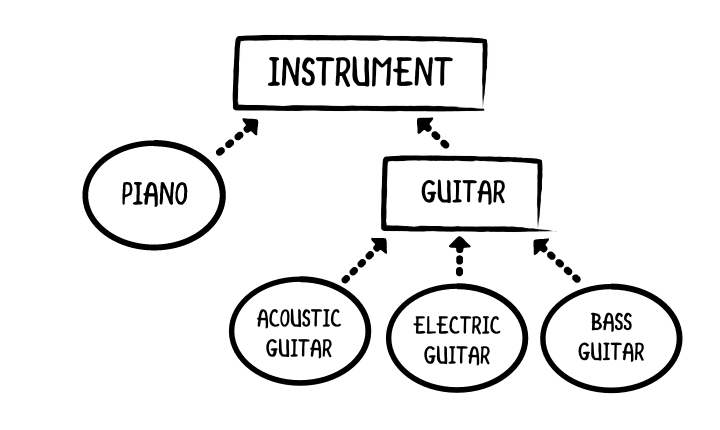
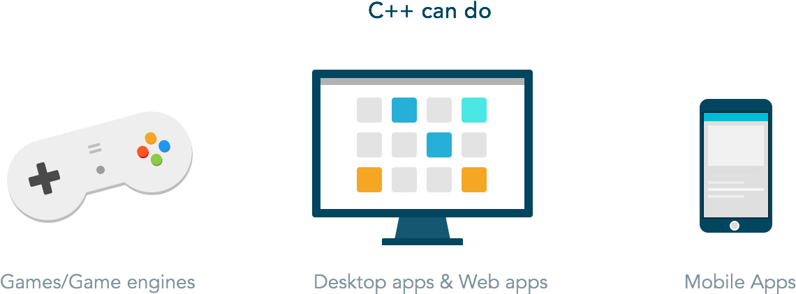

name: slide_title
class: slide_title, center, middle
layout: true

{{content}}

<div class="slide_logos">


</div>

---

name: slide_section
class: slide_section, center, middle
layout: true

{{content}}
---

template: slide_title
layout: false

# Workshop Introduction to C++

---

template: slide_section

# Why Learn C++

---

layout: false

# A bit of history

 - C++, an extension of C, was developed by Bjarne Stroustrup in the early 1980s at Bell Laboratories.
 - It provides a number of features that "spruce up" the C language
 - But more importantly, it provides capabilities for **Object-Oriented Programming**.
 - It's an imperative programming language, which means it uses statements to change the programs state.
 - It's also a procedural programming language because the program is built from one or more functions (a function is the same as a procedure, it executes commands, but in addition, it returns a value).

---

# Object-Oriented Programming

- Objects are essentially reusable software components that model items in the real world.
<br><br>

---

# What C++ can do

 - C++'s greatest strength is how **scalable** it could be, so apps that are very resource intensive are usually built with it, like **3D Games**.
 - As a **statically typed** language, C++ is generally **more performant** than dynamically typed languages because the code is type-checked before it is executed.
 - Since you have **a lot of control over how your app uses resources**, your app can take up very little resource.
<br><br>

---

template: slide_section

# Setting up a development environment

---

layout: false

# Stages of C++ Program Development

1. **Creating a Program:** Editing a file with an editor program (referred to as **source code**).
2. **Preprocessing:** The preprocessor obeys commands (**preprocessor directives**)
3. **Compiling:** The compiler translates the C++ program into machine-language code or **object code**.
4. **Linking:** C++ programs contain references to functions and data defined elsewhere so the **Linker links the object code with the code from the missing functions to produce an executable program**.
5. **Loading:** Before a program can be executed, it must first be **placed in memory**, and this is done by the **loader**, which **takes the executable image from disk and transfers it to memory**.
6. **Execution:** Finally, the computer, under the control of its CPU, **executes the program** one instruction at a time.

---

# What do you need to develop a program in C++?

 - **Compiler + Text Editor**
    - Visual Studio Code
    - Atom
    - Sublime Text
    - ...


 - **IDE**
    - Codeblocks (Lightweight)
    - Visual Studio (User friendly but very heavy)
    - CLion
    - Eclipse
    - ...

---

# Installing Compilers

Probably the most well-known C++ compilers are g++ (GNU C++ Compiler) and CLang which has support for C++, however, there are many more.

Below you can find instructions to install a C++ compiler on Windows and some Linux distros. MacOS seems to have CLang installed.

1. [Setup on linux](section02_setup_linux)
2. [Setup on windows](section02_setup_windows)
3. [Setup on MacOS](section02_setup_macos)


---

template: slide_section

# Hello World

---
layout: false

# My First C++ Program

```C++
#include <iostream> // allows program to output data to the screen

// function main begins program execution
int main()
{
    std::cout << "Hello World!" << std::endl; // display message

    return 0; // indicate that program ended successfully
} // end function main
```
Output:
```
Hello World

``` 
---
template: slide_section

# C++ Basic Syntax

---
layout: false

# #include

Line 1
```C++
#include <iostream> // allows program to output data to the screen
```
is a **preprocessor directive**, which is a message to the C++ preprocessor. Lines that begin with # are processed by the preprocessor before the program is compiled. **This line notifies the preprocessor to include in the program the contents of the input/output stream header file `<iostream>`**. This file must be included for any program that outputs data to the screen or inputs data from the keyboard using C++ style stream input/output.

---

# int main()

Line 4
```C++
int main()
```
**is a part of every C/C++ program**. The parentheses after `main` indicate that `main` is a **program building block** called a **function**. C++ programs typically consist of one or more functions and classes. **Exactly one function** in **every program** must be named `main`. C++ programs **begin executing at function `main`**, even if main is not the first function in the program. The keyword `int` to the left of main indicates that main “returns” an integer (whole number) value.

---

# Input/Output
Line 6
```C++
std::cout << "Hello World!" << std::endl; // display message
```